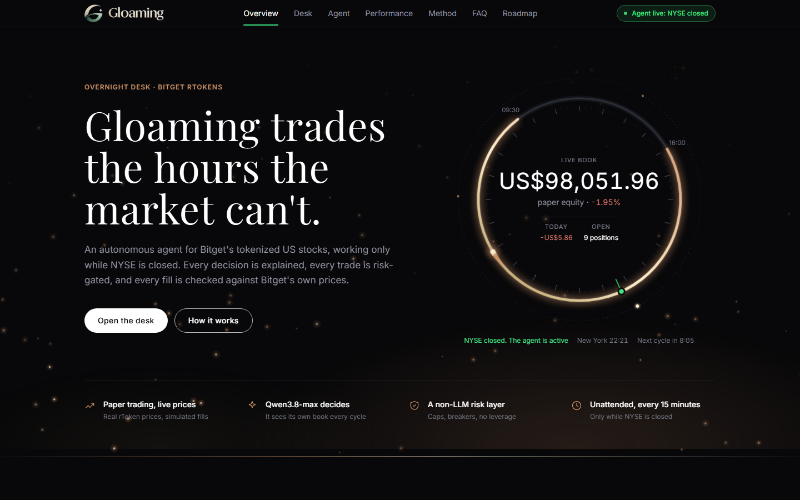
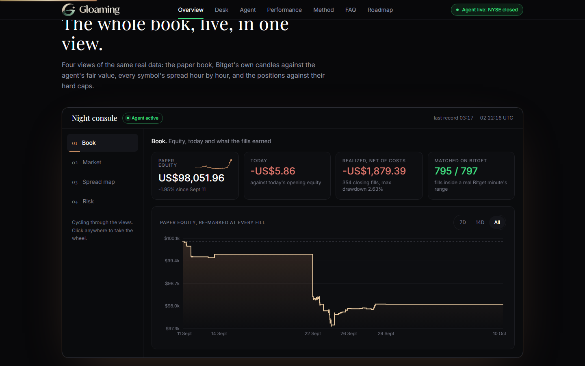
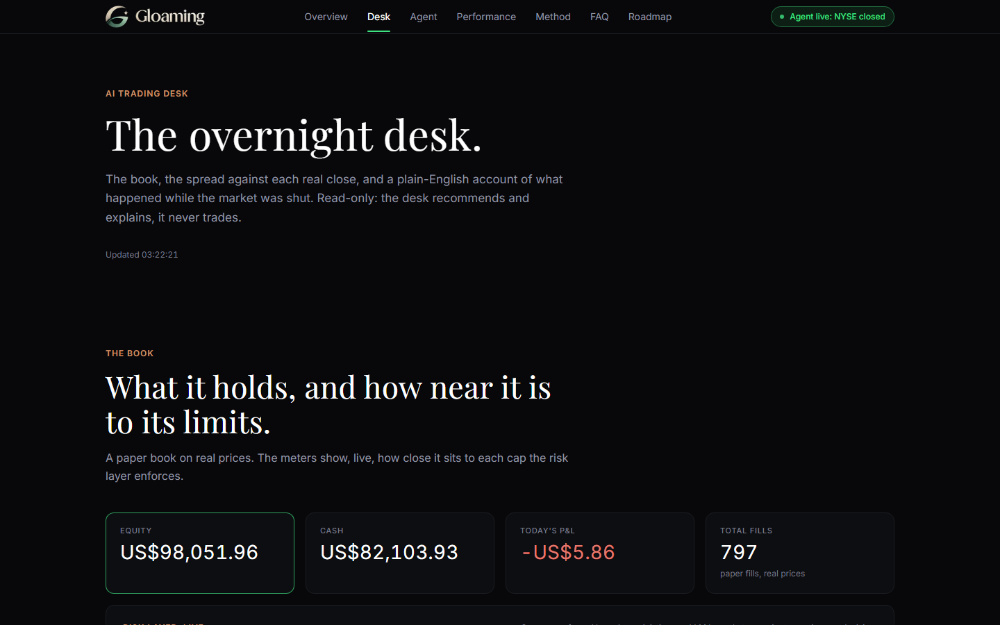
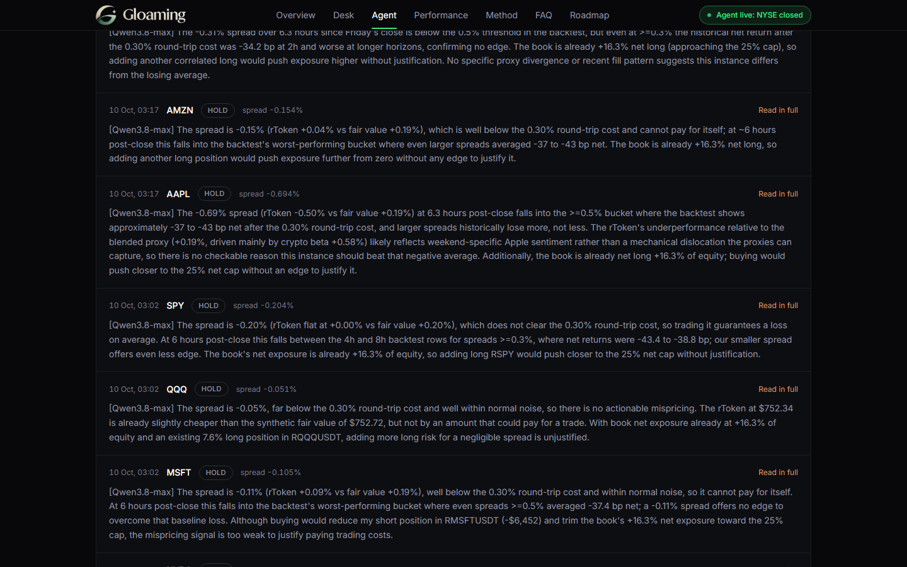
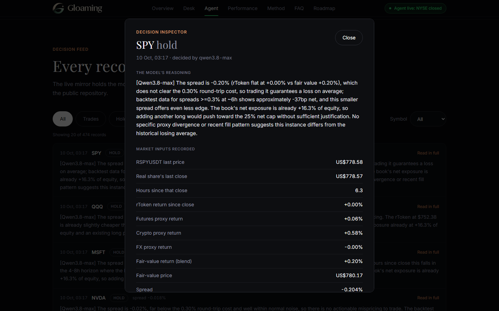
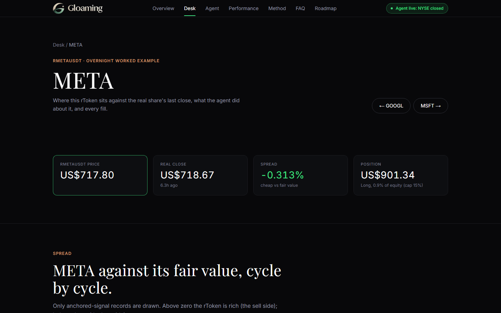
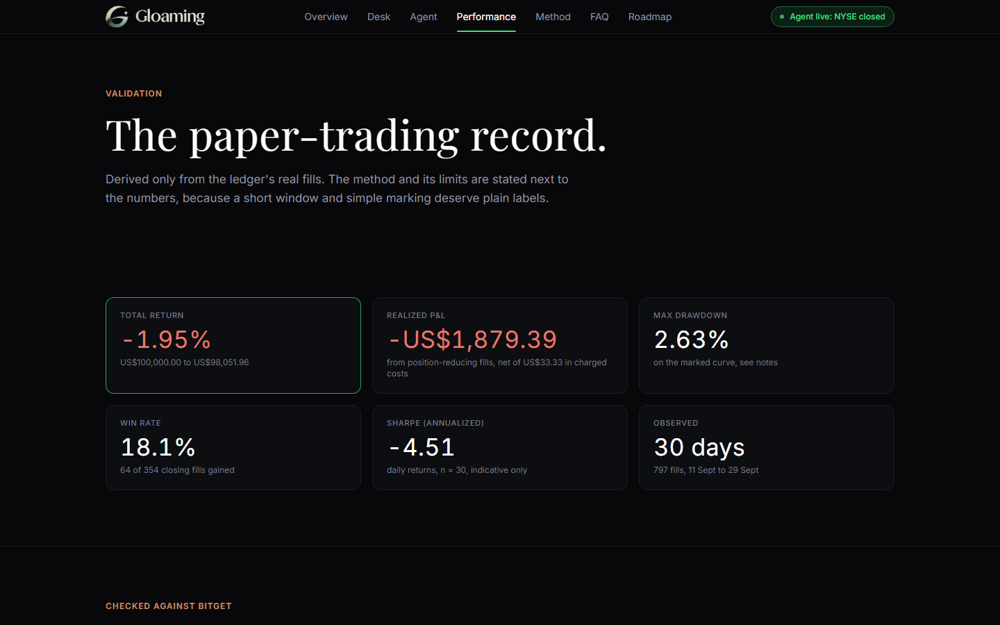
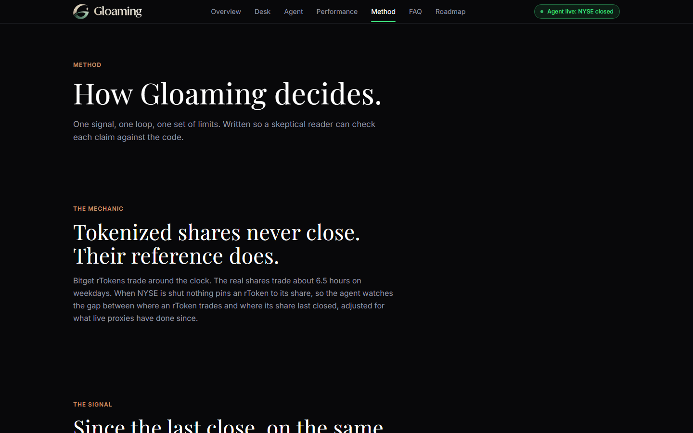
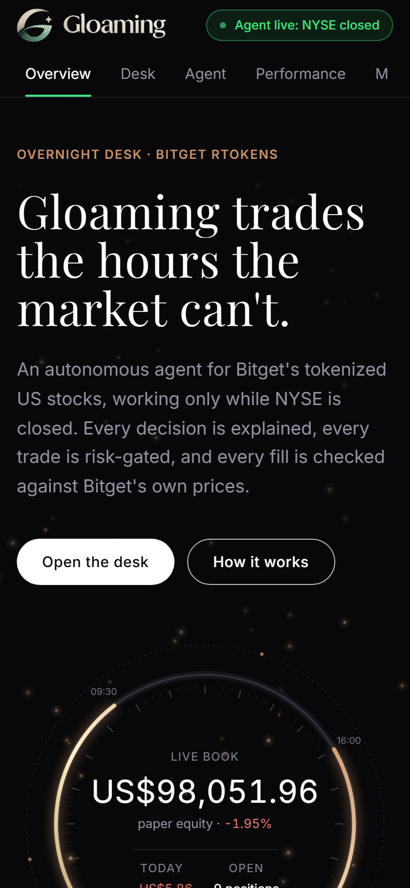
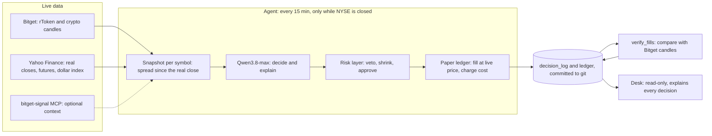

# Gloaming

**Gloaming trades the hours the market can't.**

An autonomous agent for Bitget's tokenized US stocks (rTokens) that works only while NYSE is closed, plus a read-only desk that shows every decision it makes and why. Qwen3.8-max decides, a separate rule-based layer can veto anything, and every cycle, fill and failure is committed to this repository.

[**Live Desk: gloamingdesk.vercel.app**](https://gloamingdesk.vercel.app) · [Decision log](gloaming_agent/decision_log) · [Paper ledger](gloaming_agent/paper_ledger.json) · [Run history](https://github.com/angelraph/gloaming/actions) · [Submission](SUBMISSION.md) · [Internal review](AUDIT.md) · [Architecture](docs/architecture.md) · [Risk controls](docs/risk_controls.md) · [Demo film](video/README.md)

[](https://gloamingdesk.vercel.app)

*The live Desk's landing page. Every figure on it is read from this repository's own files.*

Built for the Bitget AI Base Camp Hackathon S2 (Genesis Season 2), in the **Agentic Trading** and **AI Trading Desk** tracks.

## At a glance

| | |
|---|---|
| **Market** | Bitget spot rTokens, `R<TICKER>USDT`: AAPL, AMZN, GOOGL, META, MSFT, NVDA, QQQ, SPY, TSLA |
| **Mode** | **Paper trading.** Fills are ledger entries at live rToken prices, because Bitget's demo environment does not list rToken symbols. No real-money order path exists. An opt-in leg can also send each approved trade to Bitget's demo engine on the matching stock perpetual (virtual funds, real order book); it is built and tested but off until the demo account holds margin, and has not produced a fill yet |
| **Running since** | First paper fill 2026-09-11; unattended on GitHub Actions every 15 minutes since 2026-09-13 |
| **Record (observed)** | 797 fills from 2026-09-11 to 2026-09-29. Paper equity $98,048 (-1.95%), realized P&L -$1,879 net of $33 in costs, 64 of 354 position-reducing fills gained (18.1%), maximum drawdown 2.63%. Shown in full, loss included, on the [Performance page](https://gloamingdesk.vercel.app/performance) |
| **Decisions** | 18,486 logged, **95.5% made by Qwen3.8-max** (17,654); the rest are a disclosed rule-based fallback, and each record says which path decided |
| **Checked against Bitget** | All 797 fills compared with Bitget's own public 1-minute candles: 795 sit inside a range Bitget really traded, 2 miss by under 0.2 basis points, 33 matched only an old print and are flagged stale |
| **Thesis test (observed)** | Backtest of the live definition on 65 real sessions: trading against a spread of 0.5% or more averaged -7.6 bp gross and -37.6 bp after costs. **No cost-covering edge was found**, the agent is told so, and it has not traded since 2026-09-29 |
| **Risk layer** | Non-LLM: 15% per symbol, 60% gross, 25% net, -5% daily loss breaker, 2% per-trade loss, volatility-scaled sizing, no leverage, $1,000 ceiling per decision |
| **Desk** | Next.js: 7 pages plus a page per symbol, a decision inspector, 11 API routes, CSV and JSON downloads, keyboard and screen-reader support |
| **Tests** | 191 automated tests across the signal, ledger, risk layer, cycle behaviour and fill verification |

Last verified 2026-10-10. The live Performance page is the current source for every number.

## Contents

- [The idea in one minute](#the-idea-in-one-minute)
- [What you can check yourself](#what-you-can-check-yourself)
- [Why Gloaming](#why-gloaming)
- [Product tour](#product-tour)
- [How it works](#how-it-works)
- [What the evidence says](#what-the-evidence-says)
- [Corrections made in the open](#corrections-made-in-the-open)
- [Architecture](#architecture)
- [Verification and security](#verification-and-security)
- [Build log](#build-log)
- [Quickstart](#quickstart)
- [Repository layout](#repository-layout)
- [Documentation](#documentation)
- [Risks](#risks)

## The idea in one minute

Tokenized stocks never close, but the markets behind them do. A Bitget rToken can be bought at 3 a.m. on a Sunday while the share it tracks last traded on Friday afternoon. For about 17.5 hours every weekday, and all weekend, three things are true at once:

- **Nothing pins the price.** There is no live share to arbitrage against, so an rToken can drift from where its stock would plausibly be.
- **Nobody is watching.** A human trader is asleep and a traditional desk is closed.
- **Holders have two bad choices.** Close before the bell and give up the overnight period, or hold unmanaged and accept risk nobody is steering.

Gloaming's answer is one loop, run every 15 minutes, only while NYSE is closed:

| Step | What happens | Where it lives |
|---|---|---|
| **Observe** | For each symbol: the rToken's price, the real share's last regular-session close, and what index futures, BTC/ETH and the dollar index have done since that close | [`engine/data/overnight_anchor.py`](engine/data/overnight_anchor.py) |
| **Decide** | Qwen3.8-max reads the snapshot and its own book, then returns buy, sell or hold, a size, a stop and a written reason | [`gloaming_agent/llm_client.py`](gloaming_agent/llm_client.py), [`prompts/system_prompt.md`](gloaming_agent/prompts/system_prompt.md) |
| **Gate** | A deterministic layer with no model in it approves, shrinks or rejects the trade against hard caps | [`gloaming_agent/risk_controls.py`](gloaming_agent/risk_controls.py) |
| **Execute** | An approved trade becomes a paper fill at the live price, charged a stated cost | [`gloaming_agent/paper_ledger.py`](gloaming_agent/paper_ledger.py) |
| **Record** | The snapshot, reasoning, verdict and fill are written to the log, committed, mirrored to the Desk and checked against Bitget's candles | [`gloaming_agent/decision_log/`](gloaming_agent/decision_log), [`verify_fills.py`](gloaming_agent/verify_fills.py) |

The signal is a single number per symbol:

    fair value = real close x (1 + blended proxy return since that close)
    spread     = rToken return since that close - blended proxy return since it

The blend is 0.5 index futures, 0.3 crypto (BTC and ETH), 0.2 the dollar index inverted. Every input is measured over the same window, from the real share's last close to now.

## What you can check yourself

Nothing here asks to be taken on trust. Each claim has a file or a page behind it.

| Claim | Where to look |
|---|---|
| It runs unattended every 15 minutes | [Actions run history](https://github.com/angelraph/gloaming/actions): one run per cycle, around the clock |
| Every decision, with its inputs and reasoning | [`gloaming_agent/decision_log/*.jsonl`](gloaming_agent/decision_log): one JSON record per symbol per cycle, committed by the workflow |
| Every fill, with balance after each | [`paper_ledger.json`](gloaming_agent/paper_ledger.json), or [the CSV](https://gloamingdesk.vercel.app/api/export?dataset=fills&format=csv) with running cash and equity |
| Fills are prices the market really printed | [`fill_verification.json`](gloaming_agent/fill_verification.json), regenerated from Bitget's public candles by [`verify_fills.py`](gloaming_agent/verify_fills.py) with no API key |
| The Desk's numbers match the ledger | The Performance page rebuilds equity from fills alone and matches the live portfolio to the cent |
| The risk limits are enforced in code | [`risk_controls.py`](gloaming_agent/risk_controls.py) and its tests in [`tests/`](tests) |
| The thesis was tested, and failed | [`since_close_backtest.py`](engine/backtest/since_close_backtest.py) and its [results](alpha_factory/results/since_close_backtest.json); regenerate with the two commands in [Quickstart](#quickstart) |
| The prompt quotes the real backtest | A test fails if the numbers in [`system_prompt.md`](gloaming_agent/prompts/system_prompt.md) drift from that results file |

## Why Gloaming

| | |
|---|---|
| **Built on a mechanic specific to rTokens** | The overnight window where nothing pins a tokenized share to its stock. It is not a generic sentiment or news bot retargeted at a new asset |
| **An LLM that decides, inside limits it cannot argue with** | Qwen3.8-max is shown its own position, exposure against the caps, recent fills, the costs and the backtest, and writes its reasoning every cycle. A separate layer with no model in it can veto or shrink anything, and a labelled rule-based backstop trims an over-cap book |
| **A record that includes its failures** | A mismeasured first signal, an anchor that fell back a day, a risk layer that blocked de-risking and a dry run that overwrote the public mirror were all found, fixed and written up with tests. The loss is on the front page of the Performance view, split by signal era |
| **Tested on its own thesis** | The live definition was backtested on real hourly data, found to have no cost-covering edge, and the agent was told. Honesty here is a feature of the system, not a footnote |
| **A desk, not a dashboard** | Open any decision to see the inputs, the book Qwen saw, its reasoning and the risk verdict. A page per symbol, a stress test that replays real historical nights, a chat grounded only in the real data, and downloads |
| **Made for Bitget** | Bitget candles and tickers through the `bgc` CLI, rToken symbols, the `bitget-signal` MCP server, and an independent check of every fill against Bitget's public market data |

## Product tour

The Desk at [gloamingdesk.vercel.app](https://gloamingdesk.vercel.app) is read-only and reads this repository's own files (through a Redis mirror, with the git files as fallback). The screenshots show real data from 2026-10-10.

**Night Console**: four live views on the landing page. The paper book with equity re-marked at every fill, realized P&L net of costs and the Bitget match count; then Bitget's hourly candles against the agent's fair value, an hour-by-hour spread map for all nine symbols, and every position against its cap.



**Desk**: the book against its limits, the spread against each real close, the overnight timeline, a chat that answers only from logged data, and a stress test that replays each held symbol's worst night from real history.



**Agent**: the loop, the latest verdict per symbol, the risk limits, and a filterable feed of every decision. Qwen's reasoning is shown in full.



**Decision inspector**: open any decision to see the market inputs recorded, the book Qwen was shown, its reasoning, the risk verdict and what execution did.



**A page per symbol**: the rToken against the real share's last close, its spread history, the position, every recent decision with its reasoning, and every paper fill.



**Performance**: the record exactly as it is, derived only from real fills, net of costs, split where the signal was rebuilt, and checked against Bitget.



**Method**: the signal, the costs, the limits and each correction, in plain language.



**Mobile**: every page is checked at 390 px with no horizontal scroll.



## How it works



### The signal

Computed once per cycle by [`engine/data/overnight_anchor.py`](engine/data/overnight_anchor.py). The anchor is the last completed weekday session from the calendar (full-day 2026 holidays are listed), and the close is that session's official daily bar. Until Yahoo publishes it (about 5 hours 45 minutes after the close) the close is the last regular-session 1-minute bar of the same session, recorded as nchor_source: provisional_1m; if neither exists the cycle records an error per symbol and trades nothing. A proxy that cannot be fetched contributes nothing and is listed in `missing_proxies`; nothing is ever invented.

### The decision

[`llm_client.py`](gloaming_agent/llm_client.py) calls Qwen3.8-max with thinking mode off (a call takes 5 to 8 seconds), a 30-second timeout with one retry and a 4-minute cap on model time per cycle. The prompt gives it the snapshot, its book (position, net and gross exposure against the caps, what the risk layer would approve, recent fills), the cost of trading and the backtest's findings. It must name which historical bucket the spread falls in and give a specific reason it should differ from that average before proposing a trade. The reasoning is stored on every record, holds included. The `bitget-signal` context is optional enrichment: wired and degrading honestly, but its upstream sources returned nothing in any logged snapshot, so the model has not seen any.

### The gate

[`risk_controls.py`](gloaming_agent/risk_controls.py) runs after the model and cannot be influenced by it. Per-symbol 15% of equity, gross 60%, net 25%, a -5% daily loss breaker (de-risking is always allowed), a 2% per-trade loss limit from the stop, volatility-scaled sizing from the real share's realized volatility, no leverage and a $1,000 ceiling per decision. If the book stays over its net cap for eight active cycles, a deterministic backstop sells down at most 2% of equity per cycle and labels itself in the log. Full inventory: [docs/risk_controls.md](docs/risk_controls.md).

### The ledger and the check

[`paper_ledger.py`](gloaming_agent/paper_ledger.py) fills at the last live price and charges a stated 0.10% fee plus 0.05% slippage, recorded per fill as `cost_usd`. [`verify_fills.py`](gloaming_agent/verify_fills.py) then compares each fill with the 1-minute candles Bitget publishes for that minute and flags any whose matching trade is more than 15 minutes old.

## What the evidence says

| | Result | Label |
|---|---|---|
| Live paper record, 2026-09-11 to 2026-09-29 | 797 fills, about $265,800 traded (2.7 times starting equity), equity $98,048 (-1.95%) | observed |
| Realized P&L, net of costs | -$1,879 over 354 position-reducing fills, 64 gained (18.1%) | observed |
| Maximum drawdown | 2.63%, marked at fills so intraday drawdown is understated | observed |
| Daily Sharpe | -4.52 over 30 days, indicative only | observed |
| Earlier signal (735 fills) | 42 of 322 closing fills gained, -$1,906 | observed |
| Anchored signal (53 fills) | 14 of 24 gained, -$43 net of its costs, too few to judge | observed |
| Backtest, trading against a spread of 0.5% or more | -7.6 bp gross (standard error 5.0, 490 events, 44% winning), about -37.6 bp after a 0.30% round trip; -3.0 bp gross on a held-out final third | observed |
| Larger spreads | Worse, not better, at every horizon from 2 to 12 hours | observed |
| Trading costs | 0.10% fee plus 0.05% slippage per fill, assumptions and not Bitget's measured rToken schedule | estimated |

The honest summary: the record is a small paper loss, 735 of its 797 fills came from a signal the project itself found was mostly measuring the session's own move, and the corrected signal has no demonstrated edge in the project's own test. After the agent was told, it stopped trading, so the record has stopped growing. Everything above is on the [Performance page](https://gloamingdesk.vercel.app/performance), where the loss is the first thing shown.

## Corrections made in the open

Full detail, with commits and tests, is in [AUDIT.md](AUDIT.md).

1. **The first signal measured the wrong thing (2026-09-25).** Its inputs were over different windows, so it mostly measured each session's own move. Reported spreads reached -4.6% and +2.8% while every rToken sat within about 0.25% of its real close. Rebuilt so every input runs from the last real close; older records are labelled by `signal_spec`.
2. **The anchor fell back to the previous day (2026-09-26).** Yahoo publishes a session's daily bar about 5 hours 45 minutes after the close, and until then the agent anchored to the previous session, read a day's own move as a 4% dislocation and made 9 fills. The anchor now comes from the calendar and the bar must exist, and since 2026-10-10 the gap before the official bar lands is covered by a labelled 1-minute close (within 2.2 bp of the official close on average) instead of a skipped cycle. Those 9 fills are kept in the ledger and counted in neither signal era.
3. **The risk layer blocked de-risking (2026-09-22).** Caps that rejected risk-reducing trades left the book stuck for eight days. Now net-exposure aware.
4. **A dry run overwrote the public mirror (2026-09-26).** A local test with production credentials pushed a stale ledger to the Desk. Dry runs can no longer write to it, and every cycle re-asserts the mirror.
5. **The Performance page read better than the record (2026-09-28).** Realized P&L ignored costs. It now nets what the ledger actually charged.
6. **The agent kept trading a spread our backtest says loses (2026-09-28).** The prompt now carries the per-horizon table and requires a specific reason.

## Architecture

| Module | Role | Entry points |
|---|---|---|
| [`engine/`](engine) | Shared Python core: data loaders, the overnight anchor and fair-value model, the backtests | `data/overnight_anchor.py`, `fairvalue/model.py`, `backtest/since_close_backtest.py` |
| [`gloaming_agent/`](gloaming_agent) | The agent: loop, Qwen client, risk layer, paper ledger, fill verification, Redis mirror | `agent_loop.py`, `risk_controls.py`, `paper_ledger.py`, `verify_fills.py` |
| [`gloaming_desk/`](gloaming_desk) | The Next.js Desk | `app/`, `components/`, `lib/` |
| [`alpha_factory/`](alpha_factory) | Supplementary quantitative validation: backtest results as JSON | `results/` |
| [`.github/workflows/`](.github/workflows) | Unattended cycles and CI | `agent_loop.yml`, `test.yml` |

There is deliberately no separate API or database layer: the agent and the Desk read the same committed files. See [docs/architecture.md](docs/architecture.md) for the reasoning and the data flow.

## Verification and security

| Check | Result |
|---|---|
| Automated tests | 191 pass (`python -m pytest tests/`) |
| Desk | `tsc --noEmit` clean, `next build` succeeds |
| Unattended runs | the last 100 consecutive workflow runs succeeded |
| Fills against Bitget's candles | 797 checked: 795 matched, 2 mismatched by under 0.2 bp, 33 stale |
| Signal definition | window arithmetic, missing-proxy handling and the calendar anchor covered by tests, including a regression test for the 2026-09-26 failure |
| Prompt against backtest | a test fails if the figures in the prompt drift from the results file |
| Dry-run isolation | a test fails if a dry run makes any Redis call, even with credentials set |

Security properties:

- No code path can place a real order or move funds. The Bitget account used for reads has withdrawals disabled.
- Keys are never in the repository: they are GitHub Actions secrets, and `.env` is ignored.
- The Desk is read-only and has no execution capability.
- Every external dependency (Bitget, Yahoo, Qwen, Redis) failing degrades to "no trade" or "no data", never to an invented value.

Internal review rounds, every finding and its resolution, and the limitations that remain open are in [AUDIT.md](AUDIT.md). This is an internal review, not a third-party audit.

## Build log

| Date | Milestone |
|---|---|
| 2026-09-10 | Repository scaffolded; data loaders, fair-value model and a first backtest on real 90-day history; the agent loop running end to end, rule-based |
| 2026-09-11 | Real Bitget credentials; paper ledger (Bitget's demo does not list rTokens); Qwen3.8-max becomes the decision-maker; Desk dashboard, stress test and Redis mirror; scheduled every 15 minutes |
| 2026-09-12 | Records written the moment they exist; the schedule moves to GitHub Actions after a sleeping laptop dropped cycles |
| 2026-09-22 | `bitget-signal` integration; risk caps made net-exposure aware and the daily breaker gap fixed |
| 2026-09-24 | 25% net cap, Qwen shown its own book, a labelled backstop; Qwen's thinking mode switched off after its share of decisions collapsed |
| 2026-09-25 | **Signal rebuilt** around the real share's last close; the Desk redesigned and split into pages with a decision inspector |
| 2026-09-26 | Anchor taken from the calendar; dry runs isolated from the live mirror; fees and slippage charged; the since-close backtest written |
| 2026-09-28 | Performance shown net of costs; the model told the backtest found no edge |
| 2026-09-29 | The prompt requires the specific bucket and net return; last paper fill |
| 2026-10-07 | Every fill checked against Bitget's candles; stale matches flagged; a motion system on the landing page |
| 2026-10-09 | Night Console, new brand, Qwen's reasoning shown in full, narrated demo film |
| 2026-10-10 | This documentation reorganised around evidence: README, SUBMISSION, AUDIT, AGENTS, screenshots and the film's sources |

## Quickstart

Requirements: Python 3.13, Node 24.

```bash
# 1. Python engine and agent
cd engine && python -m venv .venv && .venv/Scripts/activate && pip install -r requirements.txt && cd ..

# 2. Bitget Agent Hub CLI (the official installer has a Windows bug, spawn npm ENOENT,
#    so install the packages directly)
npm install --save-dev @bitget-ai/bitget-agent-sdk @bitget-ai/bitget-agent-cli \
  @bitget-ai/bitget-agent-mcp @bitget-ai/bitget-agent-skill @bitget-ai/bitget-signal

# 3. Desk
cd gloaming_desk && npm install && cd ..
```

Copy `.env.example` to `.env` and fill in your own credentials; never commit `.env`. It needs a Bitget **Demo Trading** API key (not a live-account key) and a Qwen API key.

Run one cycle with no side effects (a dry run: nothing is written to Redis, and records go to a git-ignored folder):

```bash
python gloaming_agent/agent_loop.py --smoke-test
```

Run the checks:

```bash
python -m pytest tests/
cd gloaming_desk && npx next typegen && npx tsc --noEmit && npm run build
```

Reproduce the thesis test (network needed, about ten minutes of paging):

```bash
cd engine
python -m backtest.fetch_hourly           # caches real hourly history under data/cache/hourly
python -m backtest.since_close_backtest   # writes alpha_factory/results/since_close_backtest.json
```

Run the Desk locally with `cd gloaming_desk && npm run dev`. Production cycles run on GitHub Actions (`.github/workflows/agent_loop.yml`, triggered externally every 15 minutes) and the Desk is published with the Vercel CLI.

## Repository layout

```
engine/data/            loaders: rToken, futures, crypto, FX, and the overnight anchor
engine/fairvalue/       the blend weights and fair-value model
engine/backtest/        the daily backtest and the since-close backtest (hourly)
engine/api, db, events  empty placeholder packages, intentionally not built
gloaming_agent/         agent loop, Qwen client, risk layer, paper ledger, verification, mirror
gloaming_agent/prompts/ the system prompt (its backtest figures are tested)
gloaming_agent/decision_log/   one JSON line per symbol per cycle (committed by the workflow)
gloaming_desk/app/      pages and API routes
gloaming_desk/components/   UI, charts, the decision inspector
gloaming_desk/lib/      data access, performance derivation, formatting
alpha_factory/results/  backtest results as JSON
tests/                  191 tests
docs/                   architecture, risk controls, decision flow, and earlier drafts
video/                  the demo film's sources and method
media/                  screenshots used in this README
.github/workflows/      unattended cycles and CI
```

## Documentation

| Document | Contents |
|---|---|
| [SUBMISSION.md](SUBMISSION.md) | The hackathon submission: fields, eligibility, judging criteria with where each is weak, and the evidence |
| [AUDIT.md](AUDIT.md) | The internal review: every finding with its date, cause, fix and test, and the open limitations |
| [AGENTS.md](AGENTS.md) | Instructions for coding agents working in this repository |
| [docs/architecture.md](docs/architecture.md) | System design, the signal and both corrections, the execution model and the bitget-signal integration |
| [docs/risk_controls.md](docs/risk_controls.md) | The full control inventory and its tests |
| [docs/event_decision_execution_flow.md](docs/event_decision_execution_flow.md) | One decision from a live snapshot to a filled paper trade, with a worked real example |
| [video/README.md](video/README.md) | The demo film: what is real, how it was captured, how to rebuild it |

The files in `docs/` named `submission_*`, `x_post_draft.md` and `demo_video_script.md` are earlier drafts kept for history; their figures are as of their dates, and [SUBMISSION.md](SUBMISSION.md) supersedes them.

## Risks

Gloaming is a research project and not trading advice. The market data, the model's decisions and the risk checks are all real and live. The fills are paper trades: recorded at the live rToken price with a stated cost, because Bitget's demo environment did not list rToken symbols when this was built. A paper fill has not met a real order book, so real execution could differ, and the costs used are assumptions. The project's own backtest found no cost-covering edge in the signal it trades, so the paper record should be read as a research record. External data (Yahoo, Bitget's public API, Qwen) can fail or lag; Gloaming records that and does not trade on it, so some cycles are skipped. The Redis mirror is best effort and the Desk is published by hand, so what is live can lag the repository.

## License

MIT, see [LICENSE](LICENSE).
