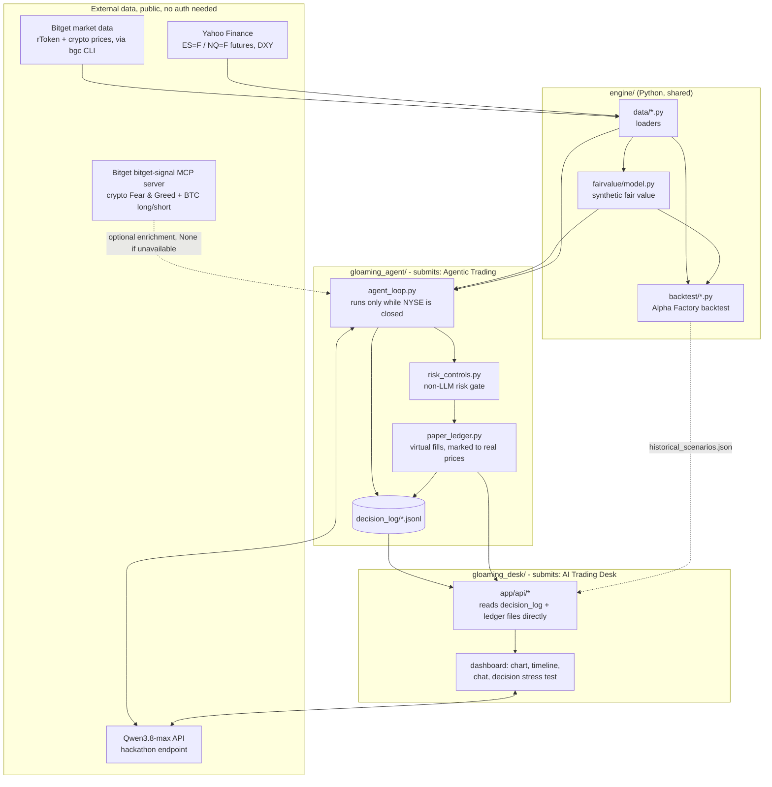

# Gloaming - Architecture

## One engine, two submissions

There is no separate FastAPI or SQLite layer - that was considered and
deliberately not built (see "Deferred, not silently missing" below). The Agent
and the Desk each read the same on-disk files directly. `bitget-signal` (crypto
sentiment + BTC derivatives positioning) is wired in directly to the Agent loop
- see "Bitget-signal integration" below for what is and isn't covered.

## Why this mechanic, not a generic trading bot

Bitget rTokens are 1:1-backed tokenized US stocks that trade 24/7 on-chain, but the
real NYSE/Nasdaq shares they track only trade ~6.5h/day on weekdays. Outside that
window there's no direct arbitrage pressure pinning the rToken price to the real
share - yet the rToken keeps trading. Gloaming's entire thesis is built on
estimating a synthetic fair value during that closed window from proxies that
*do* stay live overnight (index-futures proxies, crypto beta, FX risk sentiment),
and trading/reporting on the resulting spread. This is specific to how rToken
works, not a generic sentiment- or news-trading bot.

## Data flow

1. `engine/data/*` loaders pull rToken prices (via the Bitget Agent CLI, `bgc`),
   futures proxies (`ES=F`/`NQ=F`), crypto beta (BTC/ETH klines), and FX (DXY).
2. `engine/fairvalue/model.py` blends these into a synthetic fair value per rToken,
   weighted per `fairvalue/config.py` (heuristic prior, OLS-calibrated once enough
   overlapping history exists - see `engine/backtest/run_backtest.py`).
3. `gloaming_agent/agent_loop.py` runs only while NYSE is closed (self-enforced,
   not just documented - see `run_once()`'s `is_nyse_closed()` check). Once per
   cycle it also calls `bitget_signal.get_signal_context()` (real crypto Fear &
   Greed + BTC long/short positioning from Bitget's own public MCP server - see
   "Bitget-signal integration" below), then builds a live snapshot per symbol
   and calls Qwen3.8-max for the trade decision whenever `QWEN_API_KEY` is
   configured, falling back to a deterministic fixed-threshold rule otherwise
   (see `docs/event_decision_execution_flow.md` for the exact sequence). Every
   decision passes through `risk_controls.py` before execution.
4. Approved decisions execute via `gloaming_agent/paper_ledger.py` - a
   self-maintained virtual ledger marked to real, live rToken prices (see
   "Execution model" below for why, not `execution.py`'s Bitget CLI wrapper).
   Every cycle logs a full event -> decision -> execution record to
   `decision_log/`.
5. `gloaming_desk/` (Next.js) reads `decision_log/`, `paper_ledger.json`, and
   `alpha_factory/results/historical_scenarios.json` directly off disk to
   render the overnight timeline, fair-value-vs-actual chart, chat narration,
   and the decision-stress-test replay - read-only, no execution path.

## Execution model: why a self-maintained ledger, not Bitget's demo trading

Bitget's Agent Hub ships a `--paper-trading` flag intended to route order writes to
their demo/sandbox environment. Confirmed live Sept 11 while wiring this up: that
demo environment **does not list rToken symbols at all** - placing a demo order for
`RAAPLUSDT` returns `"Parameter RAAPLUSDT does not exist"`, while the identical call
against `BTCUSDT` succeeds up to a normal minimum-order-size check, isolating this
as an rToken-specific gap in Bitget's demo environment rather than a general
paper-trading failure or a bug in this codebase.

Since Gloaming's whole thesis is rToken execution during NYSE-closed hours, and
waiting on Bitget to add rToken coverage to their demo environment isn't viable on
a hackathon deadline, `gloaming_agent/paper_ledger.py` implements the standard
approach used by essentially every paper-trading system when a broker's own sandbox
doesn't cover an instrument: maintain a local ledger (cash, positions, fills) and
mark every fill to a REAL, LIVE price pulled from the same public Bitget market-data
feed used for every other part of this project - not synthetic or estimated data.
The only thing simulated is the "exchange accepting the order" step; the price, the
timing, the decision logic, and the risk gating are all real. `execution.py` (the
Bitget CLI wrapper, including live account reads and `--paper-trading` order calls)
is kept in the repo and still works correctly against tradable symbols like
`BTCUSDT` - it's simply no longer in the rToken decision path.

## Bitget-signal integration: real sentiment and derivatives context

`gloaming_agent/bitget_signal.py` calls Bitget's own public `bitget-signal` MCP
server (`https://datahub.noxiaohao.com/mcp`, confirmed by reading the installer
script of the `@bitget-ai/bitget-signal` package already listed in
`package.json`) directly over Streamable HTTP/JSON-RPC - no API key, no account,
no credentials. It adds two real signals to the Agent's overnight reasoning:

- `sentiment_index` - crypto Fear & Greed reading.
- `derivatives_sentiment` - BTC futures long/short positioning.

Both are fetched once per cycle in `run_once()` (not once per symbol), bundled by
`get_signal_context()`, and passed through `build_snapshot()` as an optional
`bitget_signal_context` field. `build_user_prompt()` only adds a signal section to
the Qwen prompt when real values are present - it never fills in a placeholder for
a source that returned nothing, and the raw fields the API returns are passed
through unrenamed rather than mapped onto a guessed schema for a "successful"
response this project has not yet observed live.

Every call is wrapped the same way every other external dependency in this
project is (`kv_sync.py`, `llm_client.py`): broad `try/except`, logs to `stderr`,
returns `None` on any failure, never raises into the trading loop. It also
detects the case where the MCP layer itself succeeds (`isError: false`) but the
signal server's own upstream source had nothing to return (e.g.
`{"alt_me_error": ""}`) and treats that the same as a hard failure - `None`, not
a fabricated neutral value.

Confirmed live Sept 22: the signal server's JSON-RPC layer works correctly, but
its own upstream sources (alternative.me, mempool.space) were returning empty
payloads at call time. A full real `agent_loop.py --smoke-test` run that same day
(not mocked) showed the integration degrading exactly as designed - two logged
"no real data available" lines, the rest of the 9-symbol cycle completing
normally with no crash and no change in behavior. `tests/test_bitget_signal.py`
covers the real response shape, the empty-payload case, MCP-level errors,
network failures, and the missing-session-id case (7 tests, all mocking the HTTP
layer directly - CI never touches the real network).

This covers `sentiment_index` and `derivatives_sentiment` specifically. The
broader `bitget-signal` news/macro-event skills (`news-briefing`,
`macro-analyst`) are still not integrated - see below.

## Deferred, not silently missing

Two pieces were designed early on and intentionally not built, rather than left as
an undocumented gap:

- **A separate FastAPI/SQLite service.** The Desk needs to read decision and
  portfolio data, but that data already exists in real, verified form as
  `decision_log/*.jsonl` and `paper_ledger.json` - standing up a second service to
  re-serve files that already exist would be an extra moving part with nothing to
  show for it. `gloaming_desk/lib/data.ts` reads them directly instead.
- **`bitget-signal` news/macro-event skills** (`news-briefing`, `macro-analyst`).
  Investigated on Day 5: at the time, these looked like Claude-Code-style skill
  definitions designed for an MCP-client agent environment (e.g. Claude Desktop),
  not for a Python subprocess. `sentiment_index` and `derivatives_sentiment` were
  later confirmed reachable over plain HTTP (see "Bitget-signal integration"
  above) and wired in; the remaining news/macro skills were not revisited before
  the deadline. Qwen's reasoning is grounded in the real numeric snapshot (rToken
  price, proxy returns, spread, plus sentiment/derivatives context when
  available) - genuinely real market data, just not news headlines. Noted here as
  a concrete direction for future work, not hidden.

## Alpha Factory (stretch, not a formal 3rd submission)

`engine/backtest/` is reused directly to produce a >=60-day/>=30-out-of-sample
Sharpe/Sortino/max-drawdown report (`alpha_factory/backtest_report.md`) as
supplementary validation evidence embedded in the Agentic Trading and AI Trading
Desk write-ups, and its per-day history also powers the Desk's decision stress
test (`alpha_factory/results/historical_scenarios.json`).
