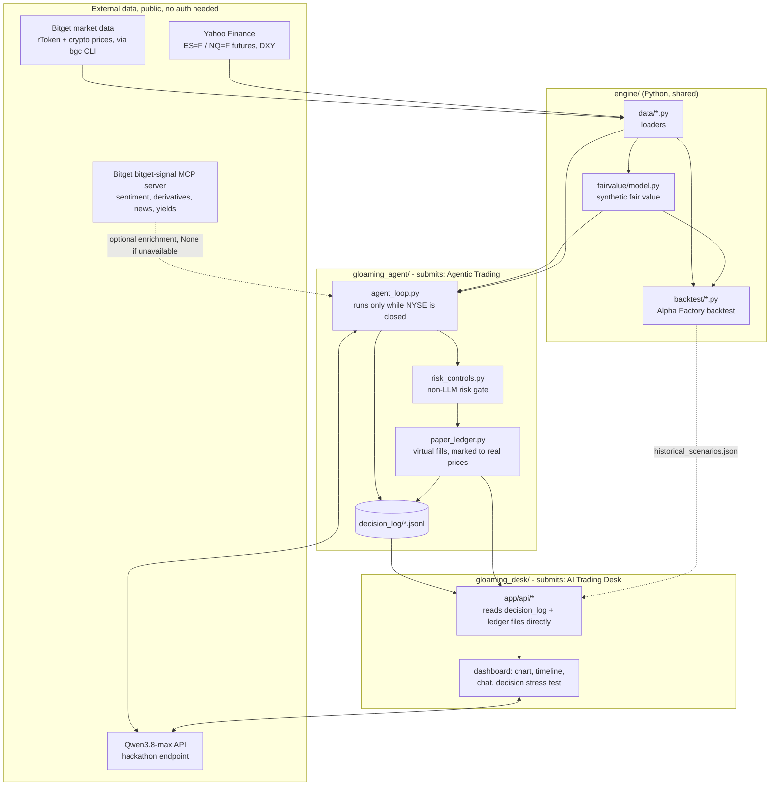

# Gloaming - Architecture

## One engine, two submissions

```mermaid
flowchart TB
    subgraph ext["External data, public, no auth needed"]
        bitget["Bitget market data<br/>rToken + crypto prices, via bgc CLI"]
        yahoo["Yahoo Finance<br/>ES=F / NQ=F futures, DXY"]
        qwen["Qwen3.8-max API<br/>hackathon endpoint"]
        signal["Bitget bitget-signal MCP server<br/>sentiment, derivatives, news, yields"]
    end

    subgraph engine["engine/ (Python, shared)"]
        data["data/*.py<br/>loaders"]
        fv["fairvalue/model.py<br/>synthetic fair value"]
        bt["backtest/*.py<br/>Alpha Factory backtest"]
    end

    bitget --> data
    yahoo --> data
    data --> fv
    data --> bt
    fv --> bt

    subgraph agent["gloaming_agent/  -  submits: Agentic Trading"]
        loop["agent_loop.py<br/>runs only while NYSE is closed"]
        risk["risk_controls.py<br/>non-LLM risk gate"]
        ledger["paper_ledger.py<br/>virtual fills, marked to real prices"]
        log[("decision_log/*.jsonl")]
    end

    fv --> loop
    data --> loop
    signal -. "optional enrichment, None if unavailable" .-> loop
    loop <--> qwen
    loop --> risk
    risk --> ledger
    loop --> log
    ledger --> log

    subgraph desk["gloaming_desk/  -  submits: AI Trading Desk"]
        api["app/api/*<br/>reads decision_log + ledger files directly"]
        ui["dashboard: chart, timeline,<br/>chat, decision stress test"]
    end

    log --> api
    ledger --> api
    bt -. "historical_scenarios.json" .-> api
    api --> ui
    ui <--> qwen
```

There is no separate FastAPI or SQLite layer - that was considered and
deliberately not built (see "Deferred, not silently missing" below). The Agent
and the Desk each read the same on-disk files directly. `bitget-signal`
(sentiment, derivatives positioning, news, and yield-curve context) is wired in
directly to the Agent loop - see "Bitget-signal integration" below for details.

## Why this mechanic, not a generic trading bot

Bitget rTokens are 1:1-backed tokenized US stocks that trade 24/7 on-chain, but the
real NYSE/Nasdaq shares they track only trade ~6.5h/day on weekdays. Outside that
window there's no direct arbitrage pressure pinning the rToken price to the real
share - yet the rToken keeps trading. Gloaming's entire thesis is built on
estimating a synthetic fair value during that closed window from proxies that
*do* stay live overnight (index-futures proxies, crypto beta, FX risk sentiment),
and trading/reporting on the resulting spread. This is specific to how rToken
works, not a generic sentiment- or news-trading bot.

## The signal, and a correction (Sept 25)

**Current specification (`since_last_close_v2`).** The question the signal answers is
"where should the rToken be now, given where the real share last closed and what has
moved since?" Every input is measured over the same window, from the last regular
session's 16:00 ET close to now:

    fair value = real close x (1 + blended proxy return since that close)
    spread     = rToken return since that close - blended proxy return since that close

with the same 0.5 / 0.3 / 0.2 blend of index futures, BTC/ETH, and inverted DXY. Once
per cycle `engine/data/overnight_anchor.py` fetches the real closes (Yahoo daily
bars), the futures and DXY moves since the close (Yahoo hourly), and the BTC/ETH move
(Bitget hourly klines). A proxy that cannot be fetched contributes nothing and is
listed in the snapshot's `missing_proxies`; a missing real close means that symbol,
or the whole cycle, gets no decision rather than one made on an invented anchor.
Each logged snapshot carries `signal_spec`, the close price and time, and the hours
since the close. Simplifications, disclosed: the close is modeled as 16:00 ET every
trading day (early closes are not modeled, as `is_nyse_closed()` already notes; full-day
2026 holidays are listed), and the blend weights are still the heuristic prior.

**What it replaced, and why it was wrong.** From Sept 10 to Sept 25 the live spread
was the rToken's rolling 24h return minus a blend of three proxy returns measured
over three different windows: the futures term was the return over the entire 5-day
window fetched (`closes.iloc[-1] / closes.iloc[0]`, documented as "24h"), the crypto
term a true 24h return, and the FX term the latest one-hour bar. Checked against real
data on Sept 25:

- Every rToken sat within about +/-0.25% of its real share's last close (most within
  0.1%), so the real overnight dislocation was about 0.1%.
- The old spreads on the same symbols were as large as -4.62% (META) and +2.80% (MSFT).
  They were the regular session's own move, which the rToken had already priced
  correctly and a proxy blend with no company-specific term cannot see, not a
  mispricing that could close. META's real share had risen 4.5% and then fallen 3.3% on
  consecutive sessions while NQ futures moved 0.3% and 0.4%; the rToken tracked the
  share within 0.3% throughout.
- The futures term used +2.76% for NQ where the true 24h return was +0.60%, tilting
  every fair value by the 5-day trend. That is the cause of the persistent one-way
  buying, and of the book swinging from about 60% net short to about 60% net long.

The paper-trading record from Sept 10 through Sept 25 was therefore produced by the old
specification and should be read that way. Records from the correction onward carry
`signal_spec: "since_last_close_v2"`; earlier ones do not. Under the corrected signal
spreads are normally a few tenths of a percent, so most decisions are holds (each hold
now keeps Qwen's reasoning in `hold_rationale`), and trading is much sparser.

The volatility-scaled sizing control used `|spread|` as its volatility input, which only
made sense while the "spread" was a multi-percent number; it now uses the real share's
realized daily volatility (last 10 sessions), so the control stays meaningful.

The Alpha Factory backtest (`engine/backtest/`, `engine/fairvalue/model.py`) works on
daily close-to-close return series, a different specification from the live signal
above, so its statistics are not evidence for it.

### A second failure, found on the first weekend (Sept 26)

Monitoring the first Saturday cycles showed `hours_since_close` of 28 to 29 for about an
hour and a half (00:02 to 01:32 UTC) where it should have been 4 to 5. Yahoo's daily data
for SPY did not yet contain Friday's bar (Yahoo publishes a session's daily bar about
5 hours 45 minutes after the close, so this happens every weekday evening, not once); the
anchor was "the newest bar returned", so it fell back to Thursday's close. Every symbol was
then priced against Thursday's close, and Friday's own session move (META's real share fell
about 3.8% that day) read as a 4% "weekend dislocation". From 01:47 UTC the bar was
published and spreads returned to about -0.6%.

The agent made 9 paper fills on the bad reading (META buys and MSFT sells, about $3,580 of
notional). They are left in the ledger unedited, since rewriting the record would defeat
its purpose; the risk layer and later cycles manage them like any other position.

The fix (`expected_last_session()` in `engine/data/overnight_anchor.py`): the anchor now
comes from the calendar, the most recent weekday session that is not a 2026 NYSE holiday
and whose 16:00 ET close has passed, and the data must contain that session's bar. If it
does not, the cycle records an error per symbol and makes no trades, instead of trading
against the wrong close. A date outside the holiday list is treated as a trading day, so an
unlisted closure also skips trading until a bar appears: the failure direction is "no
trade", never "trade on an older close". Regression tests reproduce the exact failure
(`tests/test_overnight_anchor.py`).

What the fix cost, measured, and how it was closed: because Yahoo's daily bar for a session
lands about 5 hours 45 minutes after the close, the first version of the fix skipped roughly
7 cycles (about 00:00 to 01:45 UTC, 20:00 to 21:45 New York) on every weekday evening and
logged them as errors: 66 whole-cycle skips between 2026-09-28 and 2026-10-10, 4 of them
Yahoo returning no bars at all. Nothing was traded on a wrong anchor, but the window right
after the close was unobserved.

Since 2026-10-10 the close in that window comes from the last regular-session 1-minute bar
of the SAME session (`fetch_provisional_closes`, `last_regular_minute_close`), and each
snapshot records `anchor_source`: `official_daily` or `provisional_1m`. The official close
replaces it as soon as it is published. Measured against the official close, the 1-minute
bar is within 2.2 bp on average over 63 symbol-sessions (95th percentile 5.9 bp, worst
8.8 bp), and 0.8 bp on average on the Oct 9 session when run end to end against live Yahoo
with the daily bar hidden. The last HOURLY bar was tried first and rejected: 7.2 bp on
average, up to 67 bp, and biased 6 bp high. The provisional path has two guards: the
minute series must be from the expected session and reach 15:55 ET, and if neither route
yields a close for the reference ticker the cycle still trades nothing. The prompt tells the
model when a close is provisional. The same fallback covers a single ticker that Yahoo drops
from a batch.

## Data flow

1. `engine/data/overnight_anchor.py` fetches, once per cycle, the real shares' last
   regular-session closes and the futures proxies (`ES=F`/`NQ=F`), crypto beta
   (BTC/ETH via the Bitget Agent CLI, `bgc`), and FX (DXY) moves since that close;
   the rToken price and its rolling 24h change come from `bgc`.
2. `agent_loop.build_snapshot()` blends those moves into the synthetic fair value per
   rToken, weighted per `fairvalue/config.py` (heuristic prior; the OLS calibration in
   `engine/fairvalue/model.py` and `engine/backtest/run_backtest.py` belongs to the
   daily-return backtest).
3. `gloaming_agent/agent_loop.py` runs only while NYSE is closed (self-enforced,
   not just documented - see `run_once()`'s `is_nyse_closed()` check). Once per
   cycle it also calls `bitget_signal.get_signal_context()` (real crypto
   sentiment, BTC derivatives positioning, news, and yield-curve context from
   Bitget's own public MCP server - see "Bitget-signal integration" below), then
   builds a live snapshot per symbol, adds the agent's own book context (its
   position, net/gross exposure against the caps, what the risk layer would
   approve, its recent fills), and calls Qwen3.8-max for the trade decision
   whenever `QWEN_API_KEY` is
   configured, falling back to a deterministic fixed-threshold rule otherwise
   (see `docs/event_decision_execution_flow.md` for the exact sequence). Every
   decision passes through `risk_controls.py` before execution.
4. Approved decisions execute via `gloaming_agent/paper_ledger.py` - a
   self-maintained virtual ledger marked to real, live rToken prices (see
   "Execution model" below for why, not `execution.py`'s Bitget CLI wrapper).
   Every cycle logs a full event -> decision -> execution record to
   `decision_log/`.
5. `gloaming_desk/` (Next.js) reads `decision_log/`, `paper_ledger.json`, and
   `alpha_factory/results/historical_scenarios.json` directly off disk to
   render the overnight timeline, fair-value-vs-actual chart, chat narration,
   and the decision-stress-test replay - read-only, no execution path.

## Execution model: why a self-maintained ledger, not Bitget's demo trading

Bitget's Agent Hub ships a `--paper-trading` flag intended to route order writes to
their demo/sandbox environment. Confirmed live Sept 11 while wiring this up: that
demo environment **does not list rToken symbols at all** - placing a demo order for
`RAAPLUSDT` returns `"Parameter RAAPLUSDT does not exist"`, while the identical call
against `BTCUSDT` succeeds up to a normal minimum-order-size check, isolating this
as an rToken-specific gap in Bitget's demo environment rather than a general
paper-trading failure or a bug in this codebase.

Since Gloaming's whole thesis is rToken execution during NYSE-closed hours, and
waiting on Bitget to add rToken coverage to their demo environment isn't viable on
a hackathon deadline, `gloaming_agent/paper_ledger.py` implements the standard
approach used by essentially every paper-trading system when a broker's own sandbox
doesn't cover an instrument: maintain a local ledger (cash, positions, fills) and
mark every fill to a REAL, LIVE price pulled from the same public Bitget market-data
feed used for every other part of this project - not synthetic or estimated data.
The only thing simulated is the "exchange accepting the order" step; the price, the
timing, the decision logic, and the risk gating are all real. `execution.py` (the
Bitget CLI wrapper, including live account reads and `--paper-trading` order calls)
is kept in the repo and still works correctly against tradable symbols like
`BTCUSDT` - it's simply no longer in the rToken decision path.

### The opt-in demo-exchange leg (added 2026-10-10)

Re-tested on 2026-10-10, the demo engine still rejects the spot rToken symbols
(`placeOrder symbolId is not exist`). But Bitget lists USDT perpetual futures on the same
nine stocks (`AAPLUSDT` ... `TSLAUSDT`, `symbolType: stock`, $5 minimum order), and the demo
engine recognises them: a test order on `AAPLUSDT` was rejected only with `Incorrect position
open type` (the account is in hedge mode and needed a `posSide`) and then `Insufficient
margin`, never with "symbol does not exist". So an approved decision can also be sent to
Bitget's demo matching engine as an order on the stock perpetual, with a real order book, real
fills, real fees and funding, and virtual funds.

How it is built (`execution.mirror_decision_on_exchange`, called from `agent_loop` after a
ledger fill and after a backstop trim):

- **Opt-in.** Off unless `GLOAMING_EXCHANGE_ORDERS=demo`. The workflow does not set it yet.
- **Additive.** The paper ledger stays the book of record. The exchange's order id, fill price,
  filled quantity, fee and its raw responses are stored on the decision record under
  `exchange`; a failure is recorded there and never touches the ledger or the cycle.
- **Hedge mode.** A buy first closes any short on the perpetual and opens a long with the
  rest; a sell does the mirror image. Orders below the exchange's minimum quantity or amount
  are skipped with the reason recorded. If a position cannot be read, no order is sent.
- **Cannot reach a live account.** Every call goes through the wrapper that hardcodes
  `--paper-trading`; Bitget rejects a live key sent with the demo header.

State, stated plainly: confirmed on 2026-10-10 with two real fills on Bitget's demo engine.
The demo account was switched to Advanced mode, which lets its several demo assets count as
margin (effective equity went from about $99,900 to about $1.76M), and its coins were on the
unified account. The self-test (`GLOAMING_EXCHANGE_ORDERS=demo python gloaming_agent/execution.py
--exchange-selftest`) bought 0.02 `AAPLUSDT` (order 1492718966160117761, filled at 336.44, fee
0.00404 USDT) and sold it (order 1492718989711134720, filled at 336.30, fee 0.00404 USDT). The
first run exposed a parser gap (the fee is under `feeDetail`), fixed against the real payload and
covered by a test. It was switched on in the production workflow on 2026-10-10 (`GLOAMING_EXCHANGE_ORDERS=demo`),
with a read-only health check before each cycle (`execution.py --exchange-check`) so a bad secret is visible
in the run log; it sends an order only when the agent decides to trade.

## Bitget-signal integration: real sentiment and derivatives context

`gloaming_agent/bitget_signal.py` calls Bitget's own public `bitget-signal` MCP
server (`https://datahub.noxiaohao.com/mcp`, confirmed by reading the installer
script of the `@bitget-ai/bitget-signal` package already listed in
`package.json`) directly over Streamable HTTP/JSON-RPC - no API key, no account,
no credentials. It adds four real signals to the Agent's overnight reasoning,
matching the data sources behind the package's sentiment-analyst, news-briefing,
and macro-analyst Skills:

- `sentiment_index` - crypto Fear & Greed reading.
- `derivatives_sentiment` - BTC futures long/short positioning.
- `news_feed` - crypto/market news headlines.
- `rates_yields` - Treasury yield-curve snapshot.

All four are fetched once per cycle in `run_once()` (not once per symbol), bundled
by `get_signal_context()`, and passed through `build_snapshot()` as an optional
`bitget_signal_context` field. `build_user_prompt()` only adds a signal section to
the Qwen prompt when real values are present - it never fills in a placeholder for
a source that returned nothing, and the raw fields the API returns are passed
through unrenamed rather than mapped onto a guessed schema for a "successful"
response this project had not observed live at the time the first two of these
(`sentiment_index`, `derivatives_sentiment`) were wired in.

**The news/macro skills were originally skipped on Day 5 on a mistaken
assumption** - that they needed an MCP-client host environment (e.g. Claude
Desktop) rather than a plain HTTP client. That assumption was never revisited
until Sept 22, when it turned out to be simply wrong: `news_feed` and
`rates_yields` are plain callable MCP tools over the same public endpoint,
confirmed live by calling `tools/list` directly - no different from
`sentiment_index`/`derivatives_sentiment`, which were already proven to work
from this exact plain Python client. There was no real technical blocker; the
gap existed only because the original assumption was never checked against the
live server.

Every call is wrapped the same way every other external dependency in this
project is (`kv_sync.py`, `llm_client.py`): broad `try/except`, logs to `stderr`,
returns `None` on any failure, never raises into the trading loop. `_has_real_data()`
recursively detects the case where the MCP layer itself succeeds (`isError:
false`) but the signal server's own upstream source had nothing to return - both
the flat case (e.g. `{"alt_me_error": ""}`) and a nested one (`rates_yields`
returning every individual yield tenor as `{"error": ""}` while still including
top-level fields, like `spread_10y2y: 0.0`, computed from that missing data - a
default, not a real reading, and never treated as one). `news_feed`'s emptiness
is checked directly (every requested feed returning zero items is a real "nothing
new" answer, not a failure, but still not real content) since a generic structural
check cannot tell an empty feed apart from a real one by shape alone.

Confirmed live Sept 22: the signal server's JSON-RPC layer works correctly, but
every one of its four underlying data sources (alternative.me, mempool.space, its
news aggregator, and the Treasury yield feed) was returning empty results at call
time. Real production cycles on the actual GitHub Actions runner (not just local
testing) show the same graceful degradation, and the rest of each cycle completes
normally with no crash and no change in behavior. `tests/test_bitget_signal.py`
covers the real response shape for each source, every empty/degraded pattern
observed live (including the misleading `rates_yields` case above), MCP-level
errors, network failures, and the missing-session-id case, all mocking the HTTP
layer directly - CI never touches the real network.

## Deferred, not silently missing

One piece was designed early on and intentionally not built, rather than left as
an undocumented gap:

- **A separate FastAPI/SQLite service.** The Desk needs to read decision and
  portfolio data, but that data already exists in real, verified form as
  `decision_log/*.jsonl` and `paper_ledger.json` - standing up a second service to
  re-serve files that already exist would be an extra moving part with nothing to
  show for it. `gloaming_desk/lib/data.ts` reads them directly instead.

## Alpha Factory (stretch, not a formal 3rd submission)

`engine/backtest/` is reused directly to produce a >=60-day/>=30-out-of-sample
Sharpe/Sortino/max-drawdown report (`alpha_factory/backtest_report.md`) as
supplementary validation evidence embedded in the Agentic Trading and AI Trading
Desk write-ups, and its per-day history also powers the Desk's decision stress
test (`alpha_factory/results/historical_scenarios.json`).
